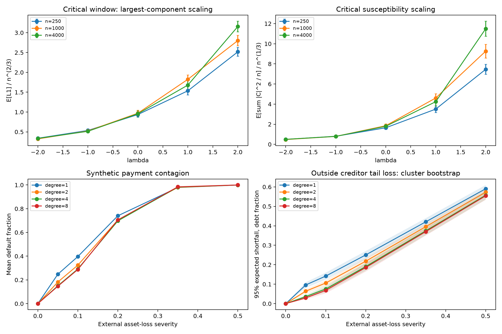

# Random graph phase transitions and systemic financial risk

Probability, finite-size scaling and network credit risk. The project extends an Erdős-Rényi study from a 2026 TIPE with critical-window susceptibility and a synthetic interbank payment-clearing model.



## Critical-window and systemic-risk research

The new graph experiment samples **3,000 independent graphs** at `p = 1/n + lambda n^(-4/3)`, across three sizes and five offsets. It reports the largest and second-largest components, susceptibility, cycle surplus and finite-component susceptibility, with Monte Carlo standard errors and distribution quantiles. The original 15,500 graph realizations remain separately reproducible.

The financial experiment constructs **128 networks of 80 banks**, with four expected degrees and weighted symmetric exposures. It solves **6,144 scenarios** across six asset-loss severities. Every bank owes a positive fraction to an outside creditor. Monotone payment iteration from upper and lower bounds is compared, and an L1 contraction bound certifies the numerical solution.

| Check | Full experiment result |
| --- | ---: |
| Maximum certified payment error, L1 | 9.98e-11 |
| Maximum upper/lower solution disagreement, L1 | 1.58e-10 |
| Maximum clearing iterations | 64 |
| Unshocked control | All banks solvent in every network |

For expected degree 8 and asset-loss severity 0.20, mean defaults rise from **56.57%** under a direct-only payment calculation to **70.60%** after clearing. The outside creditor's 95% expected shortfall is **18.58%** of its original claims, with a network-cluster bootstrap interval of **[16.46%, 20.62%]**.

The study records derivatives of clearing payments on each active default set, the default subsystem's spectral radius, resolvent amplification, direct losses and additional contagion losses. Bootstrap resampling preserves all shocks on each sampled network. Expected degree also changes debt-size heterogeneity and the fraction of isolated banks in this construction; comparisons do not isolate a causal effect of connectivity.

These are synthetic stress results. They describe proportional payment clearing without bankruptcy costs or fire sales. Zero severity is a deterministic solvency control; positive severities include additive correlated asset-loss dispersion.

## Run the research study

After installing the package as shown below:

```bash
python -m er_graphs.research
python -m unittest discover -s tests -v
python -m er_graphs.research --quick --output /tmp/network-research
```

[`docs/research.md`](docs/research.md) gives the critical scaling, balance-sheet construction, fixed-point proof, sensitivity formulas and uncertainty design. [`results/research/`](results/research) contains graph realizations, systemic scenarios, tail-risk summaries, sensitivities, figures, protocols and checksums. CI runs mathematical tests and a small complete experiment.

## Original phase-transition experiments

Monte Carlo experiments on how local graph statistics, the giant component and connectivity behave at different probability scales in the Erdős-Rényi model. The project combines the probabilistic arguments from a 2026 TIPE with an expanded, reproducible numerical study.


## Results

| Experiment | Design | Result |
| --- | --- | --- |
| Giant component | 9,000 graphs, n in {250, 1,000, 4,000}, 15 values of c, p = c/n | Mean absolute error 0.087 percentage points at n = 4,000 across the eight c values at or above 1.4 |
| Critical size | 1,500 graphs, six sizes from 250 to 8,000, p = 1/n | Fitted exponent 0.670, bootstrap 95% interval [0.646, 0.695] |
| Connectivity | 3,200 graphs, n = 1,000, eight offsets, p = (log n + s)/n | Probability RMSE 0.0094 against exp(-exp(-s)) |
| Short cycles | 1,800 graphs, n = 500, six c values | Triangle and four-cycle counts compared with exact finite-n expectations |

There are **15,500 independent graph realizations** in total, excluding sampler validation.

## Mathematical background

For a fixed cycle length k, the expected count is `(n)_k p^k / (2k)`. The asymptotic expression `c^k / (2k)` at p = c/n remains finite for every fixed c and k. A fixed-cycle threshold at the scale 1/n should not be confused with a sharp jump at c = 1.

The giant-component fraction above c = 1 solves `1 - alpha = exp(-c alpha)`. At criticality, the size of the largest component has scale n^(2/3), while the disappearance of isolated vertices and connectivity occur at the later scale log(n)/n.

Background: [Erdős and Rényi, On Random Graphs I (1959)](https://snap.stanford.edu/class/cs224w-readings/erdos59random.pdf); van der Hofstad, *Random Graphs and Complex Networks*, volume 1, chapter 4.

## Reproduce

```bash
python -m venv .venv
# Windows: .venv\Scripts\activate
# Linux/macOS: source .venv/bin/activate
python -m pip install -e .
python -m er_graphs.experiment
python -m unittest discover -s tests -v
```

Python 3.10 or later is required. The committed results were obtained with Python 3.12.14 and NumPy 2.5.3. The protocol and environment are recorded in `results/metrics.json`.

## Implementation and uncertainty

The sampler first draws the edge count from its binomial distribution, then selects a uniform subset of possible edges. This is exactly G(n,p), not a fixed-edge-count substitute. Union-find computes components. An ordering rule counts each triangle once; common-neighbor pairs count each four-cycle twice, followed by division by two. Non-induced cycles, including cycles with chords, are included.

The grids, sample counts, seed 20260930 and reporting subsets are fixed in the experiment. Critical-size intervals use 2,000 bootstrap resamples within each size. They describe Monte Carlo uncertainty for the finite-size regression, not its asymptotic bias. Connectivity intervals are pointwise Wilson intervals. Giant-component error bars describe uncertainty in the sample mean and do not remove finite-size effects.

The tests check complete and empty graphs, trees, exact cycle counts, sampler moments, edge uniqueness and the positive fixed point. Results include per-realization measurements, aggregate CSVs, bootstrap slopes, figures and CSV hashes. Different numerical versions can change the last digits or discrete draws.

## Files

- `src/er_graphs/experiment.py`: sampler, statistics and experiments.
- `tests/`: independent mathematical checks.
- `results/`: raw measurements, summaries, plots and protocol.
- `.github/workflows/checks.yml`: continuous integration.

Code: MIT license.
